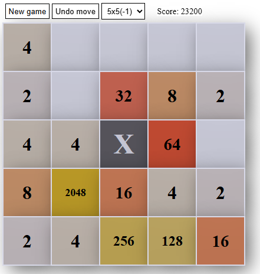
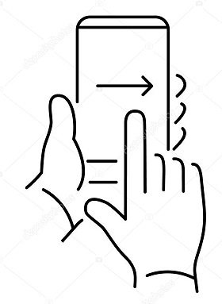
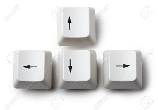

# Just another 2048 game

## Rules

Rules are the same as any other 2048 game has: You can move whole rows and columns in order to place tiles with the same value next to each other. When two tiles are neighboring, they can be merged into a new tile whose value is twice the value of the original tile. The main goal is to merge tile until you get as high value as you can. In case there is no more free places for the new tile, game is over.

## Control

* On mobile device you can swipe the screen to the desired direction

  

* On desktop you can use arrow keys

  

## Features

- 5 different table size

- Stable tiles that act like obstacles making the game more difficult

- Mobile and desktop compatibility

- Ads free

  

## Demo

Take a try here: 

https://moszkva44.github.io/2048/

